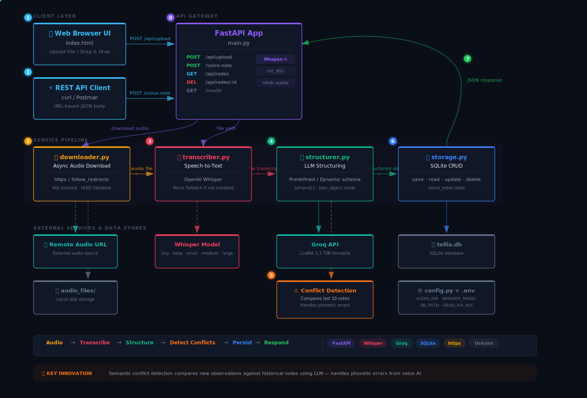

# Tellia — Voice Note Transcription Service

A modular FastAPI backend that accepts voice-note metadata, downloads the audio file, transcribes it using OpenAI Whisper (with a mock fallback), and returns the transcript.

## Architecture



## Project Structure

```
Tellia/
├── app/
│   ├── main.py              # FastAPI app, routes, exception handlers
│   ├── config.py             # Pydantic Settings (env-driven)
│   ├── schemas.py            # Request / Response models
│   ├── exceptions.py         # Custom exception hierarchy
│   └── services/
│       ├── downloader.py     # Async audio download (httpx)
│       └── transcriber.py    # Whisper transcription + mock fallback
├── requirements.txt
├── .gitignore
└── README.md
```

## Setup

```bash
# 1. Create & activate a virtual environment
python -m venv .venv
source .venv/bin/activate      # macOS / Linux

# 2. Install dependencies
pip install -r requirements.txt

```

## Run

```bash
uvicorn app.main:app --reload
```

The server starts at **http://127.0.0.1:8000**. Interactive docs are available at `/docs`.

## Usage

### `POST /voice-note`

```bash
curl -X POST http://127.0.0.1:8000/voice-note \
  -H "Content-Type: application/json" \
  -d '{
    "deviceId": "device-abc-123",
    "timestamp": "2026-03-18T10:00:00Z",
    "audioUrl": "https://www.kozco.com/tech/piano2-CoolEdit.mp3"
  }'
```

**Response:**

```json
{
  "deviceId": "device-abc-123",
  "timestamp": "2026-03-18T10:00:00Z",
  "transcript": "[Mock transcript for a1b2c3d4.mp3]",
  "audioPath": "audio_files/a1b2c3d4.mp3"
}
```

### `GET /health`

```bash
curl http://127.0.0.1:8000/health
# → {"status": "ok"}
```

## Configuration

All settings can be overridden via environment variables or a `.env` file:

| Variable | Default | Description |
|---|---|---|
| `AUDIO_DIR` | `audio_files` | Directory for downloaded audio |
| `WHISPER_MODEL` | `base` | Whisper model size (`tiny`, `base`, `small`, `medium`, `large`) |
